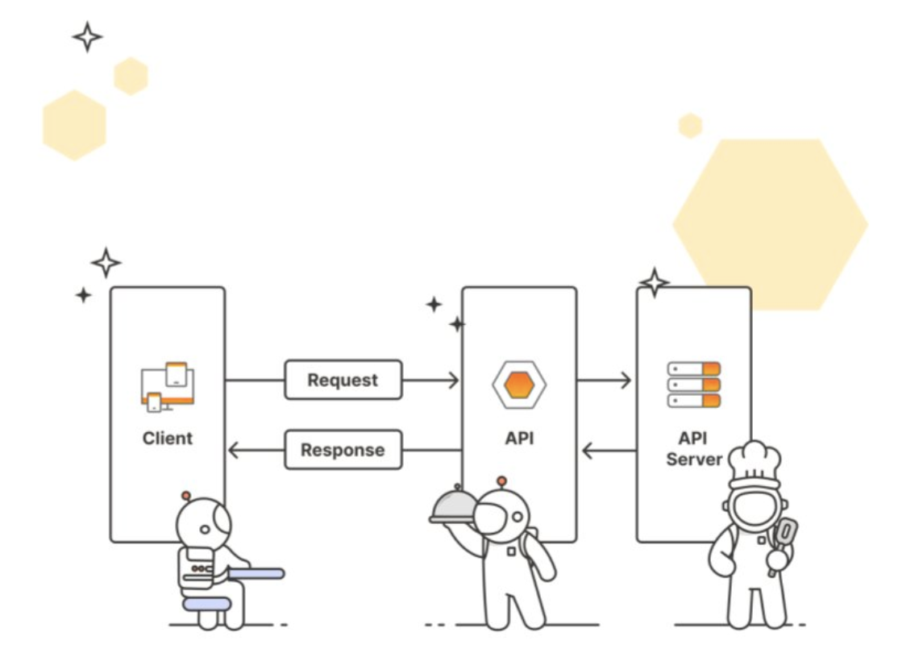

### __APIs - A Digital Restaurant__

You can think of APIs as being like a waiter at a restaurant, serving as a go-between for the customer and the kitchen. A customer who wants soup doesn’t go into the kitchen to cook. They don’t even have to know how to make soup! They only have to know how to ask the waiter for soup, expecting the waiter to bring back soup. APIs work the same way, but there are different names for the players involved. Instead of soup, the requester might ask for data or execution of a service.

| Networking term | Description | Restaurant analogy |
|-----------------|-------------|--------------------|
| Client          | The requester. Ex: browser, web app, mobile app | Customer |
| API             | Simplified interface for interacting with the backend | Waiter |
| Server          | The backend where the processing happens | Kitchen |
