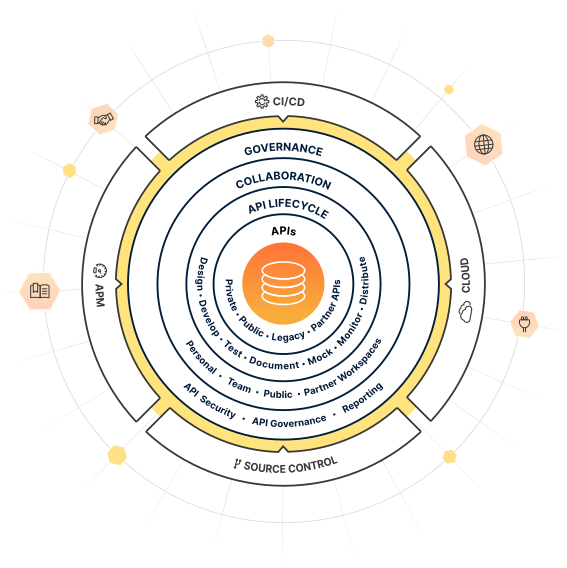
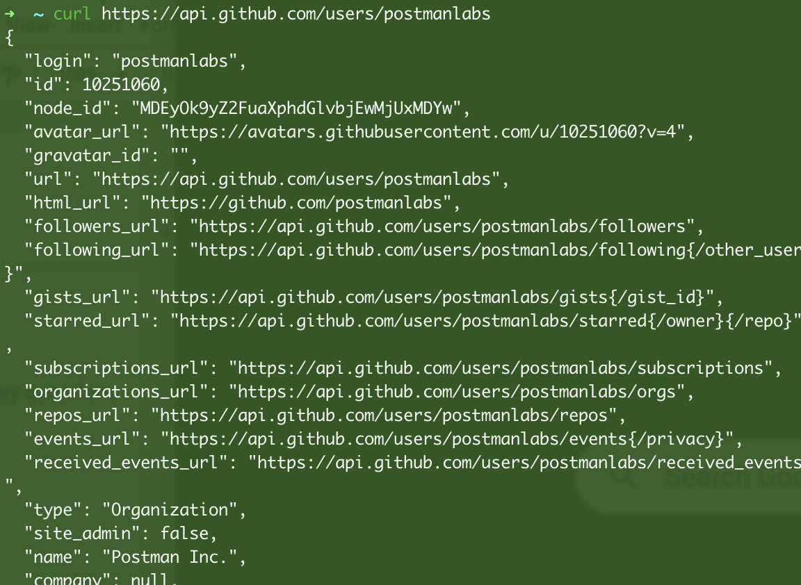
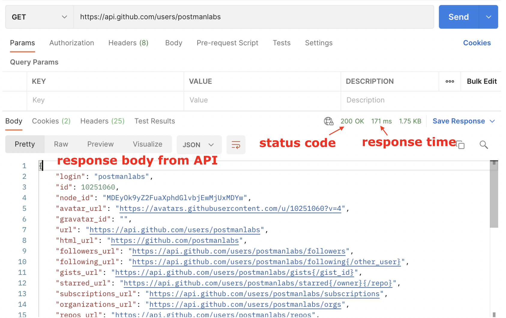

### __An API Platform__

Postman is an API platform for building and using APIs. Postman simplifies each step of the API lifecycle and streamlines collaboration so you can create better APIs faster and consume them with ease. That's why Postman is trusted by over 25 million users worldwide!



### __Working with APIs then and now: cURL vs. Postman__

#### __API calls with cURL__
Before Postman, it was common practice to poke at APIs with a command line tool for making HTTP requests called cURL. This tool is still used today but has its limitations when it comes to collaboration and sharing.

Example of an API call in the terminal using the cURL command:
```bash
curl https://api.github.com/users/postmanlabs
```
This command fetches data about the GitHub user `postmanlabs`. While it works great, the API response data is lost in the terminal, and you don't have visibility of the metadata of the response without adding more details to the command.



#### __API calls with Postman__
Here is the same call done with Postman. Postman shows the response with clean indents and colors and allows you to save, organize, and share your requests. You can also see all the components of the request and response broken down into tabs and other helpful details like the response time and status code.

