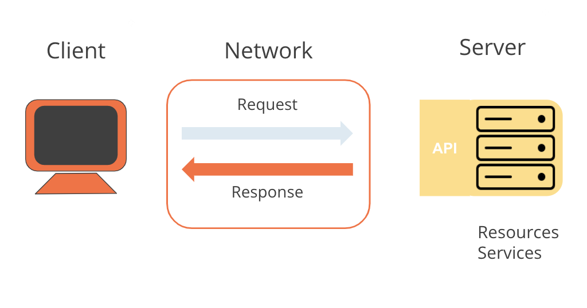

### __Request-Response Pattern__

Understanding the request-response pattern is crucial for how computers communicate over a network. An API is the interface that lets us know what kind of response to expect when we make certain calls to a server.

- **Client**: The agent making a request, such as a browser or an application. In this case, Postman is the client.
- **Request**: Sent over a network to a server. For example, a request to `GET https://library-api.postmanlabs.com/books`.
- **Server**: The backend that processes the request. The server at `https://library-api.postmanlabs.com` interprets the request and sends the appropriate response back to the client.
- **Response**: The data sent back from the server to the client. In this case, a list of books.

This pattern is fundamental to how APIs operate and how data is exchanged over the internet.