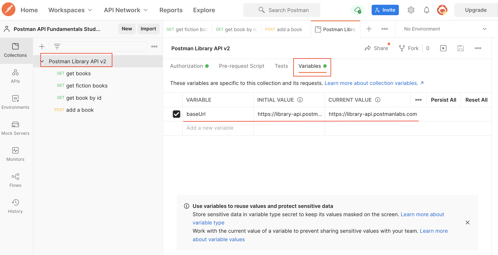

### __Variables in Postman__

Postman allows you to save values as variables to reuse them and easily hide sensitive information like API Keys. We will use a variable to replace our base URL so that we don't have to type that repeatedly. Once a variable is defined, you can access its value using double curly brace syntax like this: `{{variableName}}`.

#### __Set the "baseUrl" variable__

1. **Create a variable**:
   - Go to the "get books" request in your collection.
   - Select the entire base URL of the API (`https://library-api.postmanlabs.com`). Do not include the slash `/` after `.com`.
   - Click "Set as variable" to save the base URL to a variable.
   - Click "Set as a new variable".
   - Name your new variable `baseUrl` and select `Collection` as the scope, then click "Set variable".

2. **Use the variable**:
   - Now that the variable is set, you can access the value anywhere in your collection by typing `{{baseUrl}}`.
   - Hover over `{{baseUrl}}` to see its current value set to `https://library-api.postmanlabs.com`.
   - Save and send the request; it will work exactly like before! You should get a status `200 OK` response with a list of books.

#### __Where are my variables?__

- **Collection variables**: You can find Collection variables in your collection. Click on your collection, then the Variables tab. Here you can view and edit your variables.
- **Initial Value**: The value initially set when someone forks or imports your collection. Note that if you share your collection with others, they will see this value, so don't put any secrets here!
- **Current Value**: Postman always resolves the variable to this value. This is local to your Postman account and not public. It is good to keep secrets like API Keys ONLY in this column and not include them in the Initial Value column.