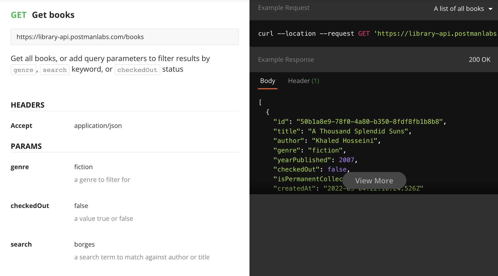
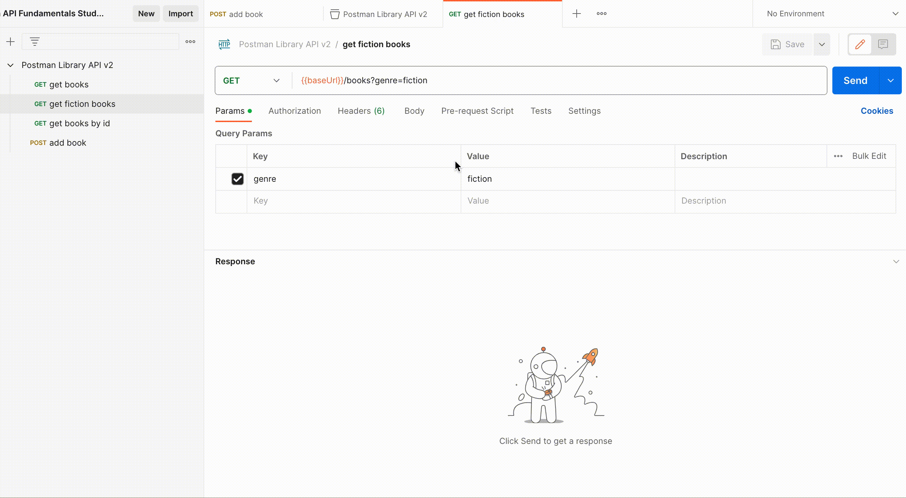

### __Task: Search Books by Genre__

Let's filter our book results to show only fiction books. The API allows us to add query parameters to a `GET /books` request to filter the results.

#### __Steps to Filter Books by Genre__

1. **Duplicate the Request**:
   - In Postman, inside the Postman Library API v2 Collection, hover over the "get books" request.
   - Click the three dots icon and select "Duplicate" to create a copy of the request.
   - Rename this second request to "get fiction books".

2. **Add Query Parameter**:

   - Using the Params tab, add a query parameter with a key `genre` and value `fiction` to the "get fiction books" request.
   - Notice how Postman syncs the request URL in real-time, adding the question mark `?` automatically to mark the start of query parameters!

3. **Save and Send the Request**:
   - Save your request.
   - Send the request to get a `200 OK` response with an array of book objects, but only books with the fiction genre.

You can try sending the request again with another value for `genre`, but don't forget to save the request before moving to the next lesson. Next, we will cover how to use multiple query parameters.