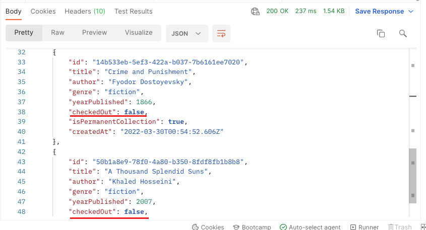

### __Task: Multiple Query Parameters__

As a librarian, you'll need to help visitors find available books (not checked out). Let's add a second query parameter to `GET /books` only to list books where the `checkedOut` property is `false`.

#### __Steps to Add Multiple Query Parameters__

1. **Add Another Query Parameter**:
   - In the same "get fiction books" request, go to the Params tab.
   - Add a second query parameter with a key `checkedOut` and value `false`.

2. **Save and Send Your Request**:
   - Save your request.
   - Send the request to get a `200 OK` response with an array of only fiction books that are not checked out, or an empty array `[]` if there are no fiction books available.

Remember to save the request before moving to the next lesson.