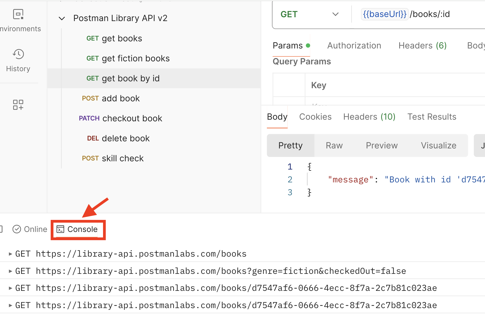

### __Task: Get a Book by ID__

Someone keeps visiting the library daily, asking whether "Ficciones" by Jorge Luis Borges is available. When you fetched all the books in the library, you may have noticed that each book has a unique id value. This id can always be used to identify the book, even if its other properties are changed. Since this person keeps asking about "Ficciones," you’ve jotted down that the unique id of this book is `29cd820f-82f9-4b45-a7f4-0924111b5b89`.

#### __Steps to Get a Book by ID__

1. **Add a New Request**:
   - Hover on your Postman Library API v2 Collection, click the three dots icon, and select "Add request".
   - Name your new request "get book by id".
   - Set the request method to `GET`, and paste this endpoint as the request URL: `{{baseUrl}}/books/:id`.

2. **Set Path Variable**:

   - In the Params tab of the request, paste the id for "Ficciones" (`29cd820f-82f9-4b45-a7f4-0924111b5b89`) as the value for the path variable named `id`.
   - Ensure there is no whitespace around the id value.

3. **Save and Send Your Request**:
   - Save and send your request.
   - You should get a `200 OK` response with a single JSON object representing the "Ficciones" book.

#### __Debugging Requests in the Postman Console__

- Use Postman’s path variable helper in the Params tab to add a path variable nicknamed `:id` to the request URL.
- Postman replaces `:id` with the value you specify for `id` in the Path Variables editor.
- View the raw request sent to the API by opening the Postman Console in the lower left of Postman. All requests and their responses are logged here.
- Check the Postman Console to ensure the raw request was sent as expected. A common error is adding accidental whitespace in your query or path parameter values.

Great job! You now know how to refine your requests with query and path variables and how to debug your requests using the Postman Console. Test your knowledge in a quick quiz before moving on.

