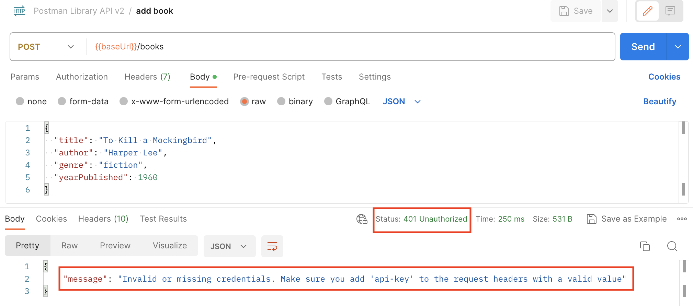

### __Task: Add a Book__

A new bestseller book arrived! As a librarian, you wish to add that book to the library. In this lesson, we will learn how to add a book via POST request with a JSON Body to submit book data to our Postman Library API database.

#### __Steps to Add a Book__

1. **Create a New Request**:
   - Hover over your Postman Library API v2 Collection, click the three dots icon, and select "Add request".
   - Name your new request "add book".
   - Set the request method to `POST` and the request URL to `{{baseUrl}}/books`.

2. **Add Body Data**:
   - Click the Body tab of the request and select the data type `raw > JSON`.
   - Add a JSON object with details about the new book's `title`, `author`, `genre`, and `yearPublished`. For example:
     ```json
     {
       "title": "To Kill a Mockingbird",
       "author": "Harper Lee",
       "genre": "fiction",
       "yearPublished": 1960
     }
     ```

3. **Save and Send Your Request**:
   - Save and send your request.

#### __Handling Errors__



- If you receive a `401 Unauthorized` response, it means you need to add an API key to the headers of the request. This will be addressed in the next lesson.