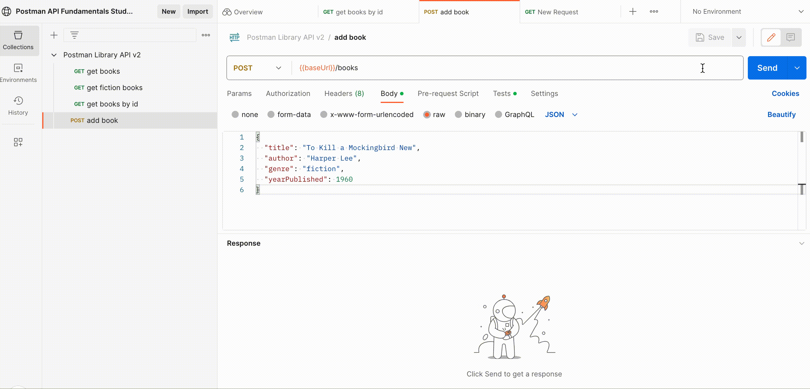

### __Task: Add an Authorization Header__

Some APIs require authorization for certain endpoints to permit a request. Authorization ensures that only authorized users can access or modify data.

#### __Why Authorization?__
- Prevents unauthorized access to sensitive data.
- Protects APIs from being overwhelmed by unauthorized requests.

#### __Methods of Authorization__
- **Basic Auth**: Uses a username and password.
- **OAuth**: Delegated authorization.
- **API Keys**: Secret strings registered to a developer from an API portal.

#### __Getting an API Key__
- Developers sign up in a developer portal to receive an API Key.
- The API Key tracks who is making calls and how often.

#### __Postman Library API v2 Authorization__
- **Header Name**: `api-key`
- **Header Value**: `postmanrulz`
- This header is required for adding, updating, and deleting books.

#### __Steps to Add the API Key to the Request Header__
1. **Open the "add a book" request**.
2. **Click the Headers tab**.
3. **Add the key `api-key` with the value `postmanrulz`**.
4. **Save and Send your request**.

#### __Success!__
- You should get a `201 Created` response with a response body representing your newly added book.
- The new book will have a unique id, `checkedOut` status, and `createdAt` timestamp.

#### __Optional: View Your New Book__

- Use the "get books by id" request and replace the `id` path parameter with the id of the newly added book to view it.

Next, we will explore an easier way to add authorization in Postman.