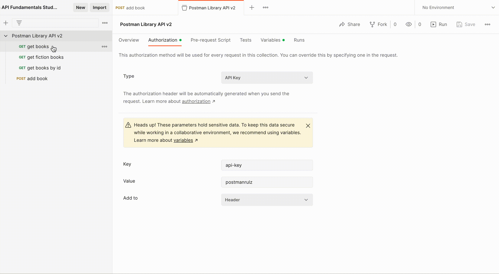

### __Task: Use Postman Auth Instead!__

Postman provides an Auth helper to simplify the process of adding authorization to requests.

#### __Steps to Use Postman Auth__

1. **Delete the Hard-Coded Header**:
   - Go to the "add a book" request.
   - In the Headers tab, hover over the `api-key` header and click the "x" icon to delete it.
   - Save your request.

2. **Add Auth to the Collection**:
   - Click on your collection "Postman Library API v2" and select the Authorization (or Auth) tab.
   - Select `API Key` as the auth Type.
   - Enter the API Key details:
     - Key: `api-key`
     - Value: `postmanrulz`
     - Add to: `Header`
   - Save the changes to your collection by clicking the floppy disk icon in the upper right.

3. **Add a New Book**:

    

   - Go back to your "add a book" request.
   - Ensure the Auth method in the Authorization tab is set to `Inherit from parent`.
   - Add another book by changing the body in the Body tab.
   - Save and send your request.

4. **Verify the New Book**:
   - Use the "get books by id" request to see your new book with the new id.

This method ensures that all requests in the collection will automatically include the API Key.