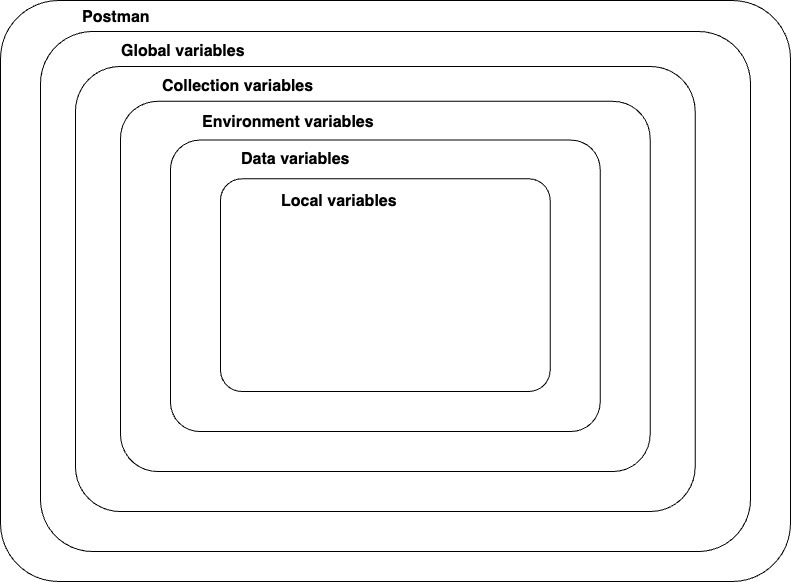

### __Variables in Postman (Continued)__

Postman allows you to save values as variables to reuse them and hide sensitive information like API keys. Variables can be set at various scopes, from broadest to narrowest: global, collection, environment, data, and local. If a variable with the same name exists in multiple scopes, the narrowest scope's value is used.

- **Global Variables**: Accessible anywhere in Postman.
- **Collection Variables**: Accessible within a specific collection.
- **Environment Variables**: Specific to a particular environment.
- **Data Variables**: Used in data-driven testing.
- **Local Variables**: Specific to a single request or script.

In this section, we focus on collection variables, which live at the collection level and can be accessed anywhere inside the collection. Next, you will learn how to set a variable via scripting.

### Note💡: If a variable with the same name is declared in two different scopes, the value stored in the variable with narrowest scope will be used. For example, if there is a global variable named `username` and a local variable named `username`, the local value will be used when the request runs.