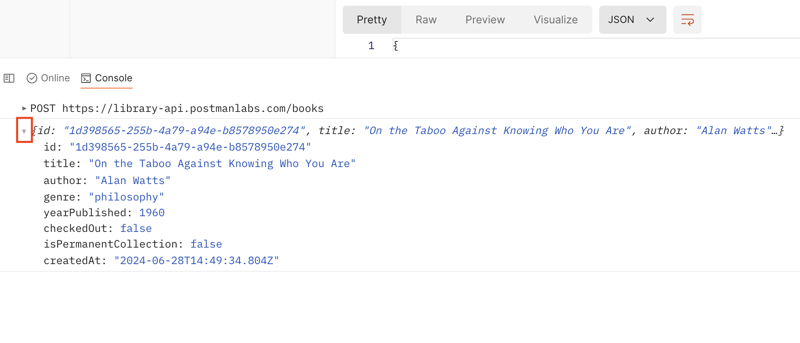

#### __JavaScript Basics__

- **Logging Data**: In JavaScript, you can print data to the console using the `console.log()` function.
  ```javascript
  console.log("Hello world!"); // => Hello world!
  ```

- **Comments**: You can add comments to your code to explain what it does. Comments are skipped by the interpreter.
  - Single-line comments start with two slashes `//`.
    ```javascript
    // This is a single-line comment
    ```
  - Multi-line comments are enclosed in `/*` and `*/`.
    ```javascript
    /* This is a 
       multi-line comment */
    ```


### __Task: Your First Script__

In this task, you will learn how to add a script to your request in Postman to log the JSON response from the API.

#### __Steps to Add a Script__

1. **Change Book Data**:
   - In your "add a book" request, change the book data in your Body to a new book you like.

2. **Open the Post-response Script Tab**:
   - From the Scripts tab of your request, open the Post-response tab.

3. **Add JavaScript Code**:
   - Inside the Script editor, add this JavaScript code to log the JSON response from the API:
     ```javascript
     console.log(pm.response.json());
     ```

4. **Save and Send Your Request**:
   - Save your request.
   - Send your request. This will trigger the script in the Post-response script tab to run after the response comes back from the API.

5. **View the Response in the Postman Console**:



   - Open the Postman Console in the lower left of the window.
   - Scroll to the bottom of the logs in the console. You will see your most recent request `POST https://library-api.postmanlabs.com/books`.
   - The response data from the API is logged in the console because of the code in your Scripts tab. You can expand the data by clicking on the small arrow to the left.

#### __Next Steps__

Congratulations! You've written your first script. Next, you'll learn how to grab the automatically generated id of your new book and save it as a collection variable using code.
