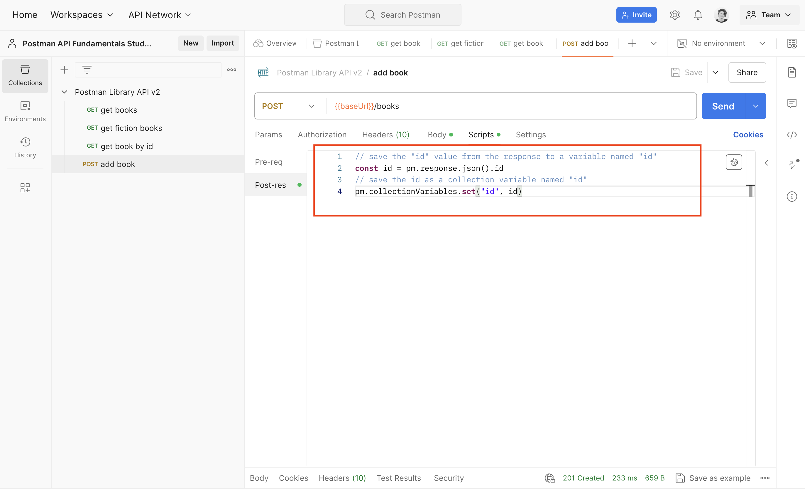
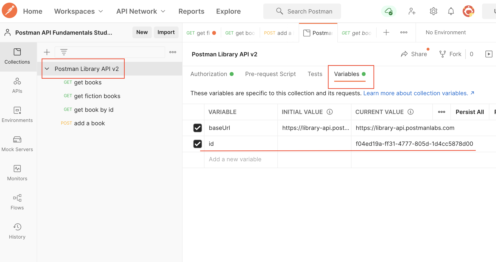

### __Task: Grab the New Book ID__

Combining the power of variables and scripting gives you superpowers! Let's explore how you can automatically set a value for a variable via scripting. Saving a value as a variable allows you to use it in other requests. Using a Post-response script, let's grab the id of a newly added book and save it so we can use it in future requests.

#### __Setting and Getting Collection Variables__

The `pm` object allows you to set and get collection variables.

- **Set a Collection Variable**: Use the `.set()` method with two parameters: the variable name and the variable value.
  ```javascript
  pm.collectionVariables.set("variableName", value);
  ```

- **Get a Collection Variable**: Use the `.get()` method and specify the name of the variable you want to retrieve.
  ```javascript
  pm.collectionVariables.get("variableName");
  ```

#### __Local Variables__

We can also store local variables inside our scripts using JavaScript. There are two ways to define a variable in JavaScript: using the `const` or `let` keywords.
- `const` is for variables that won’t change value.
- `let` allows you to reassign the value later.

#### __Set the New Book ID as a Variable__

1. **Change Book Details**:
   - In the Body tab of the "add a book" request, change the book's details to add a new book.

2. **Add Script to Post-response Tab**:
   - In the Post-response tab in Scripts of the "add a book" request, replace the `console.log()` statement with this code:
     ```javascript
     // save the "id" value from the response to a variable named "id"
     const id = pm.response.json().id;
     // save the id as a collection variable named "id"
     pm.collectionVariables.set("id", id);
     ```

     

   The comments above that start with `//` help explain what the code is doing and are ignored when we run the script.

3. **Save and Send Your Request**:
   - Save and send your request. When the `201 Created` response comes back from the API with your newly created book, the test script will run and save the book's id as a collection variable automatically.

4. **View Your Collection Variables**:

   

   - Click on your Postman Library API v2 collection, then the Variables tab. The `id` variable has been automatically assigned the id of your new book as its Current Value. You can now use `{{id}}` anywhere in your collection to access this value.


This will come in handy for our next request.