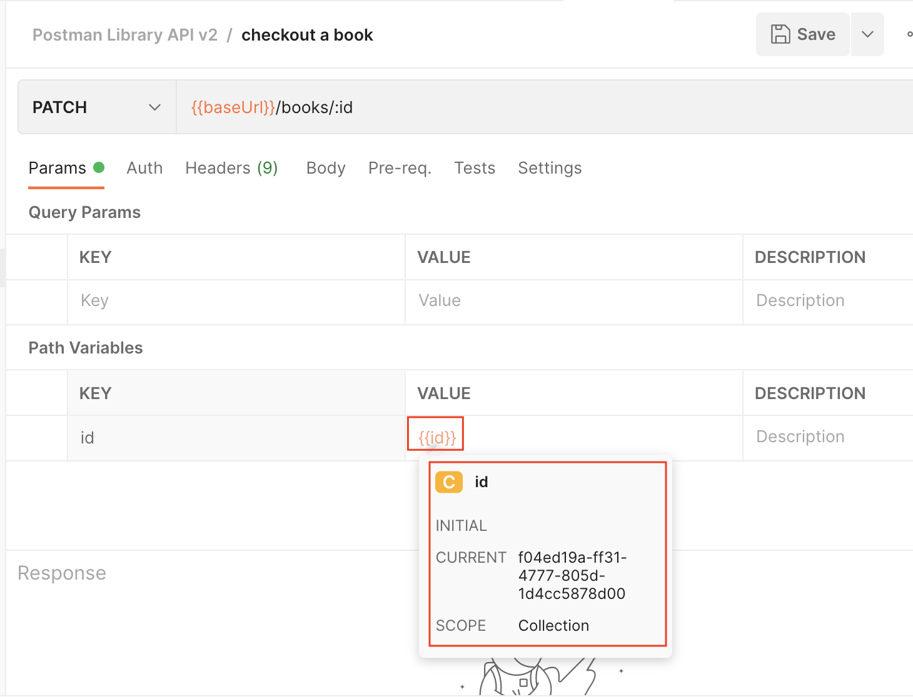

### __Task: Checkout Your Book__

As a librarian, you will update the library database via the API to mark the book's `checkedOut` status from `false` to `true`.

#### __Steps to Checkout a Book__

1. **Create a New Request**:
   - Hover over your Postman Library API v2 collection, click the three dots, and select "Add request".
   - Name your new request "checkout a book".
   - Set the request method to `PATCH`.
   - Set the request URL to `{{baseUrl}}/books/:id`.

2. **Set Path Variable**:

    

   - Set the value of the path variable `id` to `{{id}}`. This will use the value of the collection variable named `id` that was set in the Test script of the "add a book" request.

3. **Add JSON Body**:
   - In the Body tab, add a raw JSON body to update the `checkedOut` property to `true`:
     ```json
     {
       "checkedOut": true
     }
     ```

4. **Save and Send Your Request**:

    

   - Save and send your request. You should get a `200 OK` response showing the updated data about your book, with `checkedOut` now set to `true`.

5. **Verify the Update**:
   - Return to your "get book by id" request, update the `id` path variable value to `{{id}}`, save, and send. You will see the updated data with `checkedOut` set to `true`.

This process ensures that the book's status is updated in the library database, reflecting that it has been checked out.