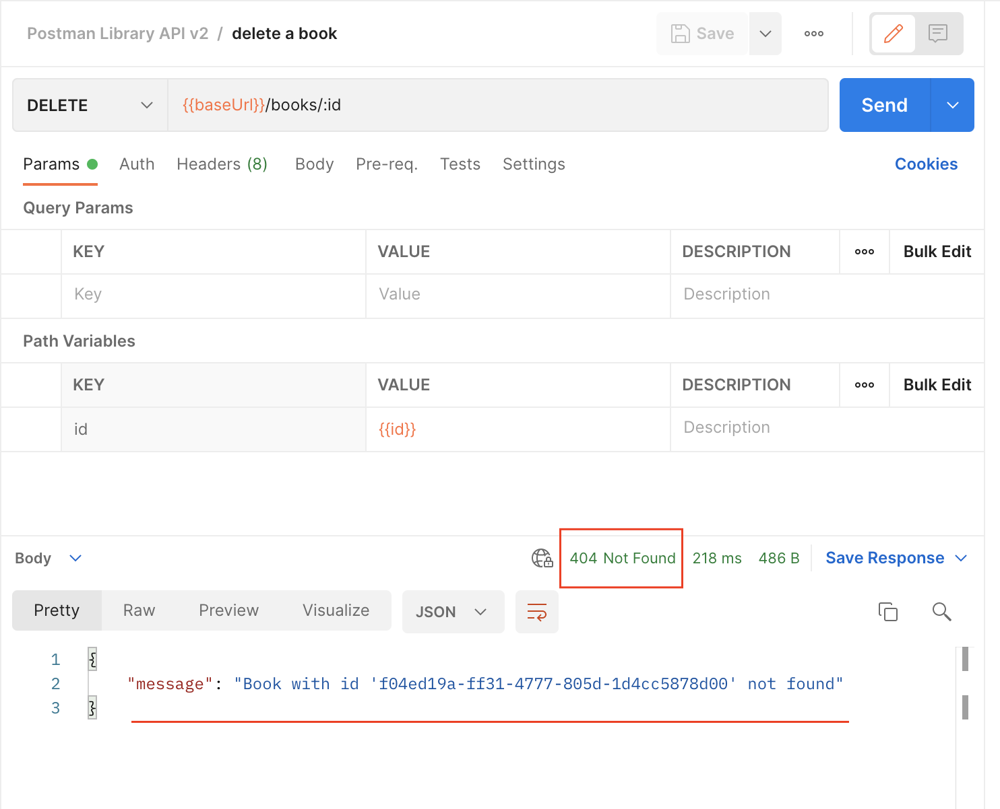

### __Task: Delete Your Book__

If a book is lost, you need to delete it from the library database using the API.

#### __Steps to Delete a Book__

1. **Create a New Request**:
   - Hover over your Postman Library API v2 collection, click the three dots, and select "Add request".
   - Name your new request "delete a book".
   - Set the request method to `DELETE`.
   - Set the request URL to `{{baseUrl}}/books/:id`.

2. **Set Path Variable**:
   - Ensure the path variable `id` is set to `{{id}}`.

3. **Save and Send Your Request**:
   - Save and send your request. You should get a `204 No Content` response, indicating the book was successfully deleted.

4. **Verify Deletion**:

    

   - Try sending the request again. You should get a `404 Not Found` error, confirming the book no longer exists in the database.

This process ensures that the book is removed from the library database.